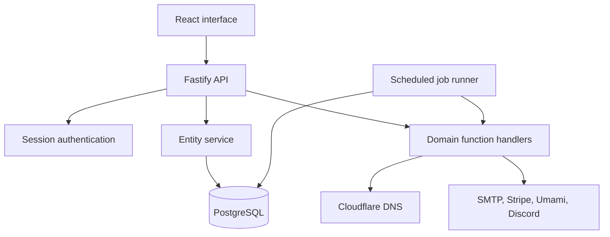

# Rootminster V2 Architecture

## Request flow

## Data model

Identity and session records use dedicated relational tables. Operational entities use a typed `entity_records` table backed by PostgreSQL JSONB. This keeps compatibility with the existing interface's entity API while adding GIN and expression indexes for ownership, status, names, keys, and creation time.

The API enforces access rules before returning or mutating records. Function handlers use a privileged internal client only after performing their own authentication and role checks.

## Runtime processes

- `app` serves the API and the compiled single-page application.
- `jobs` runs DNS verification, synchronization, suspended-domain cleanup, donation cleanup, and weekly Discord statistics.
- `postgres` stores all durable application state.

PostgreSQL advisory locks prevent duplicate scheduled jobs when more than one job process is accidentally started.
