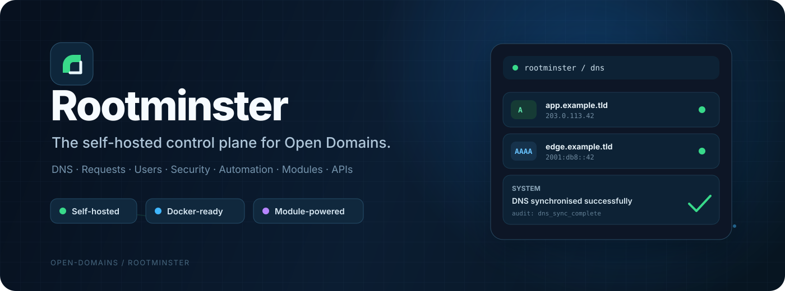
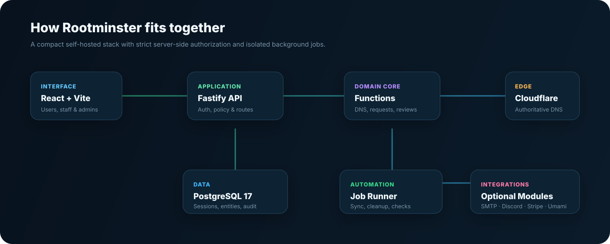

<div align="center">



<br />

[](https://nodejs.org/)
[](https://www.postgresql.org/)
[](https://react.dev/)
[](https://fastify.dev/)
[](https://www.docker.com/)

**Own the platform. Own the data. Own the DNS.**

Rootminster is the self-hosted management platform behind Open Domains. It brings DNS, domain requests, user accounts, staff tooling, security controls, integrations, APIs, background jobs and a curated module system together in one deployable stack.

</div>

---

## ⚡ Why Rootminster?

Rootminster is built for running a real shared-domain platform without stitching together a pile of disconnected admin tools.

It gives operators one place to manage the full lifecycle of a domain service:

| | Capability | What it does |
|---|---|---|
| 🌐 | **DNS management** | Manage zones and DNS records through Cloudflare with ownership and permission checks enforced server-side. |
| 📨 | **Domain requests** | Accept, review, approve, reject and audit subdomain requests with staff workflows. |
| 👥 | **Users & roles** | Local accounts, OAuth login, sessions, email verification, staff roles and administrator controls. |
| 🛡️ | **Safety screening** | Explainable request risk scoring, protected-brand signals, velocity checks and staff overrides. |
| 🔑 | **Scoped API tokens** | Restrict tokens by permission, hostname, DNS type and expiry. |
| 📡 | **Dynamic DNS** | Dedicated DDNS endpoints for controlled A and AAAA record updates. |
| 🧩 | **Module Store** | Install integrity-verified modules from the official curated registry. |
| ⚙️ | **Background automation** | DNS checks, synchronisation, cleanup and scheduled platform maintenance. |
| 📊 | **Analytics** | Optional per-subdomain analytics through Umami. |
| 💬 | **Discord tooling** | Signed slash commands for user and staff workflows. |
| 💳 | **Donations** | Optional Stripe-backed donations and donation-gated features. |
| 🔍 | **Audit trail** | Keep an operational record of sensitive platform actions. |

Rootminster is deliberately modular. Core platform functions stay lean while optional services can be switched on, configured and replaced from the admin interface.

---

## 🧩 A platform that can grow with you

Rootminster includes a built-in **Module Store** backed by a curated GitHub registry.

Modules are not blindly downloaded and executed. The store validates registry metadata, verifies SHA-256 integrity, checks supported permissions, restricts trusted download locations and records installation activity in the audit log.

Installed modules can be:

- enabled or disabled
- updated
- quarantined
- rolled back to a previous version
- removed cleanly

Module configuration is managed from the admin UI, while sensitive settings are encrypted before being stored in PostgreSQL.

> The default registry is `open-domains/Rootminster-modules`.

---

## 🏗️ Architecture



Rootminster is intentionally compact:

- **React 18 + Vite** powers the web interface.
- **Fastify on Node.js 24** serves the API and production frontend.
- **PostgreSQL 17** stores identities, sessions, operational entities, settings and audit data.
- A separate **job runner** handles scheduled maintenance and synchronisation.
- **Cloudflare** provides authoritative DNS integration.
- Optional modules add SMTP, Discord, Stripe, Umami, OAuth and other services.

PostgreSQL advisory locks prevent duplicate scheduled jobs when multiple job runners are accidentally started.

For a deeper look, see [`ARCHITECTURE.md`](ARCHITECTURE.md).

---

## 🚀 Quick start

### 1. Clone the repository

```bash
git clone https://github.com/open-domains/Rootminster.git
cd Rootminster
```

### 2. Create your environment file

```bash
cp .env.example .env
```

At minimum, configure:

```env
APP_URL=https://rootminster.example.com
POSTGRES_PASSWORD=replace-this-with-a-strong-password
```

### 3. Start Rootminster

```bash
docker compose up -d --build
```

The stack starts:

- `app` — Rootminster web interface + API
- `jobs` — scheduled jobs and maintenance
- `postgres` — PostgreSQL 17

By default the application is bound to:

```text
127.0.0.1:3000
```

### 4. Create the first administrator

You can seed an administrator directly:

```bash
docker compose exec \
  -e ADMIN_EMAIL=admin@example.com \
  -e ADMIN_PASSWORD='replace-with-a-long-password' \
  app npm run db:seed-admin
```

Or, on a brand-new installation, configure `INITIAL_SETUP_KEY`, open `/setup`, create the first administrator and then remove the setup key from the environment.

Database migrations run automatically when the application container starts.

---

## 🌍 Running behind Traefik

Rootminster includes an optional Traefik overlay.

Create or reuse the external Docker network configured by `TRAEFIK_NETWORK`, then run:

```bash
docker compose \
  -f compose.yml \
  -f compose.traefik.yml \
  up -d --build
```

The overlay creates an HTTPS router for `APP_HOST` and forwards traffic to Rootminster inside Docker.

For internet-facing deployments, HTTPS should be considered mandatory before enabling authentication or API access.

---

## 🧰 Module configuration

Optional integrations are configured from:

```text
Admin → Module Settings
```

Rootminster currently exposes modules for:

- Module Store
- Cloudflare DNS
- SMTP email
- Cloudflare Turnstile
- Stripe donations
- Google OAuth
- GitHub OAuth
- Discord
- automated safety screening
- MCP server
- Umami analytics

Secrets stored through Module Settings are encrypted with AES-256-GCM and are never returned to the browser.

Existing environment-based integration settings can be imported once into the database. After checking the imported configuration, the matching optional environment variables can be removed.

Only bootstrap and runtime values need to remain in the environment, such as database connectivity, application URL, encryption keys and initial setup settings.

---

## 🔌 API

Rootminster ships with a versioned REST API under:

```text
/api/v1
```

Interactive documentation is available at:

```text
/api-docs
```

The OpenAPI 3.1 document is exposed at:

```text
/api/v1/openapi.json
```

Users can create hashed bearer tokens under:

```text
Settings → API Tokens
```

### Scoped tokens

API tokens can be restricted by:

- permission
- exact hostname
- DNS record type
- expiry date

Dynamic DNS uses the dedicated `dns:dynamic` permission and:

```text
POST /api/v1/dynamic-dns
```

DDNS tokens must be restricted to owned hostnames and A/AAAA record types. The endpoint can use the caller's public IP or an explicitly supplied public IPv4/IPv6 address.

It will **not** silently create a new DNS record if the target record does not already exist.

### Rate limiting

Default limits include:

| Access type | Default limit |
|---|---:|
| Public reads | 60 requests/minute/IP |
| Authenticated reads | 120 requests/minute/token |
| Authenticated writes | 30 requests/minute/token |

Responses expose standard limit, remaining, reset and retry headers.

The legacy `/functions/publicApi?action=…` endpoint remains available for compatibility.

---

## 🛡️ Security by default

Rootminster is built around server-side authorization rather than trusting the browser.

Key protections include:

- Argon2id password hashing
- database-backed sessions
- role checks on protected actions
- narrowly scoped API tokens
- rate limiting
- encrypted module secrets
- Cloudflare Turnstile support
- audited administrative actions
- request risk screening
- trusted module registry restrictions
- SHA-256 module integrity verification
- module quarantine and rollback support

### Request safety screening

Accepted requests receive a versioned, explainable risk assessment covering signals such as:

- suspicious wording
- preview URL structure
- protected brands
- account age
- request velocity
- rejection history
- sensitive DNS record types
- shared DNS targets

The score helps staff prioritise reviews. It never approves requests automatically.

Staff can inspect individual signals, re-run screening or override a verdict with a mandatory audited reason.

---

## 🤖 Remote control plane access

Rootminster can optionally expose its role-aware remote control endpoint at:

```text
https://your-host/mcp
```

The endpoint uses OAuth 2.1 authorization-code flow with PKCE, dynamic client registration, short-lived access tokens and rotating refresh tokens.

Permissions are evaluated against the user's current Rootminster role on every call. Changing or disabling a staff account therefore takes effect immediately on subsequent requests rather than leaving stale authorization inside long-lived tokens.

All authenticated users can inspect their own account, requests and subdomains. Staff and administrators can additionally review pending requests and perform normal approval or rejection operations, with the same audit and notification behaviour used by the web interface.

---

## 📦 Importing existing data

The importer accepts either an object keyed by entity name or an object containing an `entities` property.

Example:

```json
{
  "entities": {
    "User": [],
    "Domain": [],
    "DnsRecord": [],
    "SubdomainRequest": []
  }
}
```

Import from a local file:

```bash
npm run db:import -- ./export.json
```

Or stream the export into the running application container:

```bash
docker compose exec -T app node scripts/import-data.js - < export.json
```

Legacy IDs are retained in `legacy_id` while new UUIDs are generated for Rootminster.

Imported users are marked as verified, but passwords are not imported. Existing users must use the password-reset flow before signing in with email and password.

---

## 💻 Local development

Install dependencies:

```bash
npm install
```

Point `DATABASE_URL` at a PostgreSQL database, then run:

```bash
npm run db:migrate
npm run dev
```

Vite serves the web interface and proxies API requests to the local Fastify process.

### Useful commands

| Command | Purpose |
|---|---|
| `npm run dev` | Start the web and API development processes |
| `npm run dev:web` | Start only the Vite frontend |
| `npm run dev:api` | Start only the Fastify API |
| `npm run build` | Build the production frontend |
| `npm start` | Start the production API and frontend |
| `npm run jobs` | Start scheduled jobs |
| `npm run db:migrate` | Apply database migrations |
| `npm run db:seed-admin` | Create or update an administrator |
| `npm run db:import -- FILE` | Import an existing data export |
| `npm run lint` | Run code-quality checks |
| `npm run lint:fix` | Fix supported lint problems |
| `npm run typecheck` | Type-check the JavaScript/JSX project |

---

## 🔐 Production checklist

Before exposing Rootminster publicly:

- [ ] Use a strong PostgreSQL password.
- [ ] Keep PostgreSQL on the internal Docker network.
- [ ] Put the application behind HTTPS.
- [ ] Configure a persistent module encryption key.
- [ ] Use a narrowly scoped Cloudflare API token restricted to the required zones.
- [ ] Enable Turnstile for public forms where appropriate.
- [ ] Never commit `.env`, database exports or production secrets.
- [ ] Back up the `postgres_data` volume before upgrades or bulk imports.
- [ ] Remove `INITIAL_SETUP_KEY` after the first administrator is created.
- [ ] Review installed module permissions before enabling them.

---

## 🐳 Docker at a glance

```text
┌──────────────────────────────────────────────┐
│                  Rootminster                 │
├──────────────────────────────────────────────┤
│  app       Web UI + Fastify API             │
│  jobs      Scheduled maintenance            │
│  postgres  Durable platform data            │
└──────────────────────────────────────────────┘
```

The default Compose network is internal, keeping PostgreSQL and background services away from the public network surface.

---

## 🌱 Built for Open Domains

Rootminster is designed to handle the less glamorous parts of running a shared domain service too: approvals, DNS drift, authentication, moderation signals, auditability, background cleanup and safe extensibility.

The result is one control plane that can start small, run comfortably in Docker and grow into a much larger domain platform without turning into infrastructure spaghetti. 🍝🚫

<div align="center">

### Rootminster
**One platform. Every domain workflow.**

</div>
