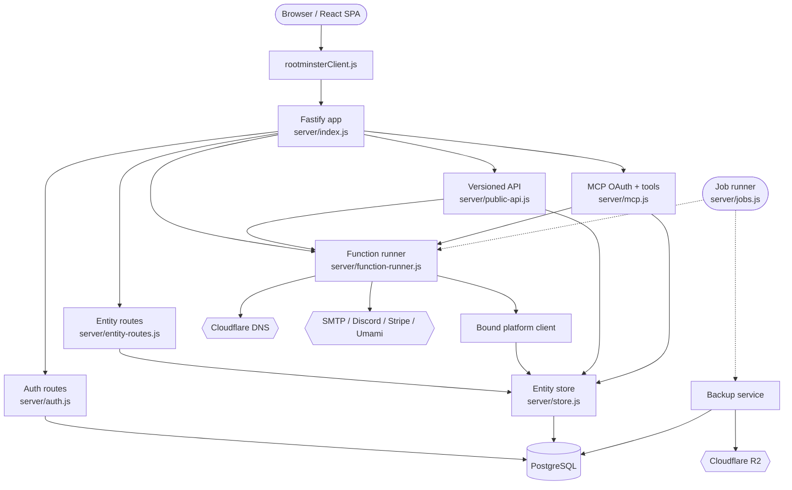

# Architecture

Rootminster runs as two Node.js processes plus PostgreSQL: the web/API process (`server/index.js`) and a job runner (`server/jobs.js`). In production the API process also serves the compiled Vite single-page app from `dist/` and falls back to `index.html` for non-API routes.

The main API surface is split into conventional Fastify route modules, generic entity routes, function handlers, the versioned `/api/v1` public API, and `/mcp` remote-control routes. Business operations usually flow through `server/functions/*.js`, which receive a request-bound platform client from `server/lib/platform-client.js` and then use the store, integration modules, and external services.

Durable state is PostgreSQL. Identity/session/security tables are relational; operational records such as `Domain`, `SubdomainRequest`, `DnsRecord`, `ApiToken`, `AuditLog`, and `PlatformSettings` live in a typed `entity_records` JSONB table. Module secrets are stored through `PlatformSettings` after encryption.

## Components

- **React SPA** — routes and screens in `src/App.jsx`, `src/pages/`, and `src/components/`.
- **Browser API client** — `src/api/rootminsterClient.js` wraps fetch calls for auth, entities, functions, admin modules, backups, Docker management, terms, passkeys, and API tokens.
- **Fastify runtime** — `server/index.js` configures security middleware, rate limits, health checks, route modules, static frontend serving, and shutdown.
- **Auth/session layer** — `server/auth.js`, `server/passkeys.js`, and `server/security.js` provide registration, login, OAuth, password reset, cookie sessions, impersonation-aware public user serialization, and MFA checks.
- **Entity API + store** — `server/entity-routes.js` enforces read/write access; `server/store.js` maps entities to `users` or `entity_records` queries.
- **Function runner** — `server/function-runner.js` imports allowed handlers from `server/functions/`, executes them over HTTP routes or internal calls, and masks server errors in production.
- **DNS and request workflows** — `submitRequest`, `approveRequest`, `rejectRequest`, `manageDnsRecord`, `verifyDnsRecords`, `scheduledSync`, and shared libraries coordinate validation, ownership, Cloudflare DNS, and audits.
- **Public API** — `server/public-api.js` exposes `/api/v1` endpoints, creates/revokes scoped bearer tokens, validates token scope/hostname/type restrictions, and serves OpenAPI docs.
- **MCP server** — `server/mcp.js` implements OAuth 2.1/PKCE dynamic-client flow and role-aware tools for users and staff.
- **Module settings** — `server/module-settings.js` defines optional integrations and handles encrypted secret persistence.
- **Jobs/backups** — `server/jobs.js` schedules operations; `server/backup-service.js` creates/restores encrypted PostgreSQL backups in Cloudflare R2.

## System Diagram

## Data Flow

1. **Browser boot** — `src/main.jsx` renders `src/App.jsx`, which wraps routes in `AuthProvider`, `QueryClientProvider`, `BrandRuntime`, `SetupGate`, and error/toast components.
2. **Session discovery** — `AuthProvider` calls `rootminster.auth.me()`, which hits `/api/auth/me`; `authenticateRequest()` hashes the cookie/bearer token and joins `sessions` to `users`.
3. **Entity reads/writes** — frontend calls `/api/entities/:entity`; `entity-routes.js` checks `userCanRead`, `canWrite`, and redaction rules before using `store.js`.
4. **Operational commands** — frontend calls `/api/functions/:name`; `function-runner.js` authenticates, imports the handler, binds actor context, and forwards headers/body/search.
5. **DNS mutation** — handlers such as `approveRequest` and `manageDnsRecord` validate records, check ownership/blocklists/conflicts, call Cloudflare, update `DnsRecord`/`SubdomainOwnership`, and audit.
6. **Token API** — `/api/v1` validates scoped bearer tokens stored as hashed `ApiToken` entities, applies hostname/type restrictions, and delegates selected work to handlers.
7. **Automation** — `jobs.js` invokes internal function handlers under `system@rootminster.local` and uses advisory locks to avoid duplicate runs.

## Key Design Decisions

- Browser and public API surfaces are separate: browser sessions use cookies and entity/function routes; public automation uses scoped API tokens under `/api/v1`.
- Sensitive module values are configured through module definitions and encrypted before storage; public config returns only safe feature/branding flags.
- Function handlers are allow-listed in `FUNCTION_NAMES`; internal-only jobs are removed from `HTTP_FUNCTION_NAMES`.
- Scheduled tasks and backup/restore operations use PostgreSQL advisory locks, so duplicate job containers should not perform duplicate work.
- `entity_records` trades strict relational columns for compatibility with flexible operational records, while critical identity/security tables stay relational.
