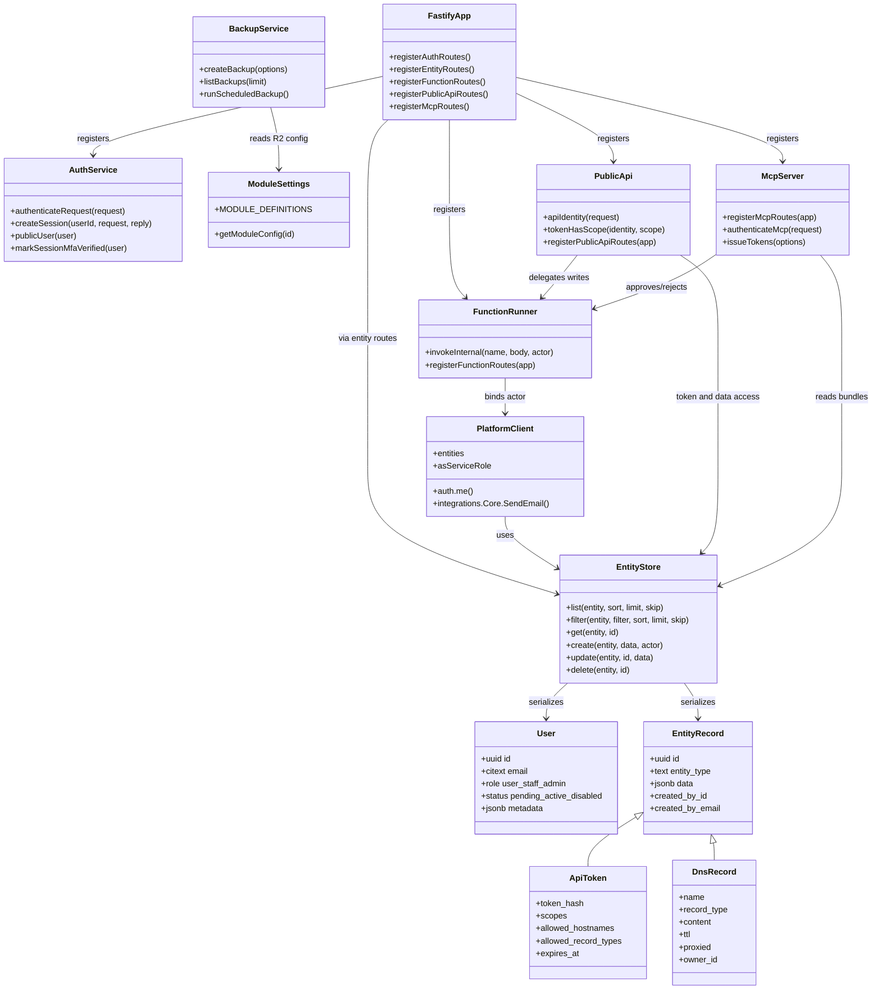

# Class / Type Diagram

Rootminster is mostly functional JavaScript, so this diagram shows the main service-like modules and persisted record types rather than classes.

## Notes

- `ApiToken` and `DnsRecord` are JSONB entity records, not SQL tables of those exact names.
- `User` is a relational table and receives special handling in `store.js`.
- `PlatformClient` is a request-bound adapter so function handlers can use auth/entities/integrations consistently.
