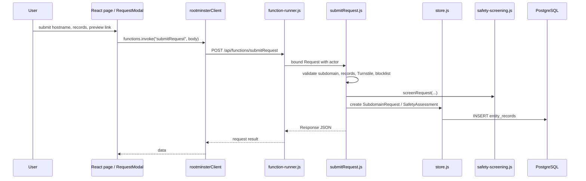
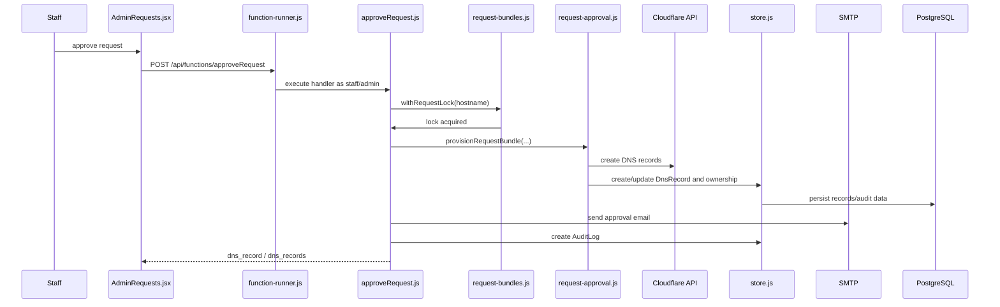
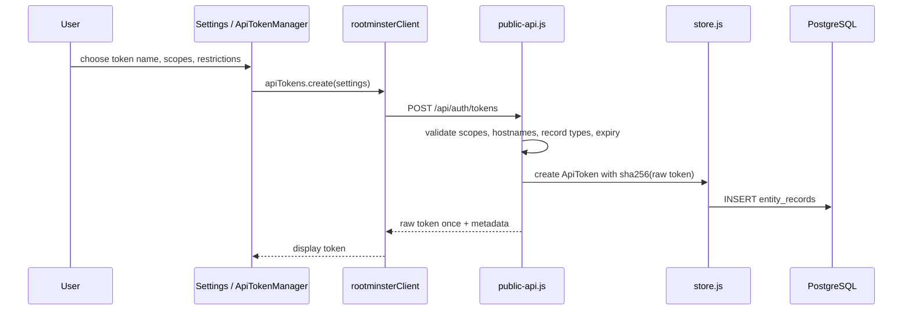
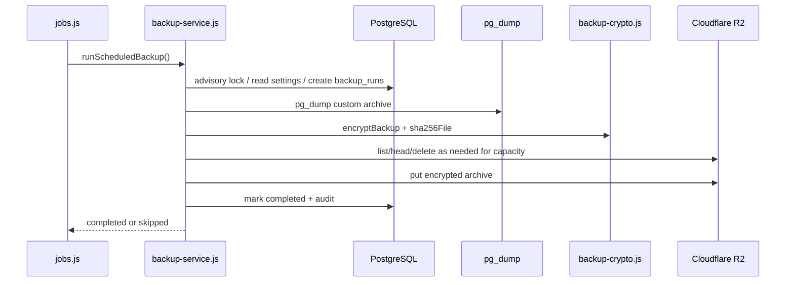

# Sequence Diagrams

## Workflow: User submits a subdomain request

A signed-in user submits one or more DNS records for staff review.

### Walkthrough

1. Frontend uses `src/api/rootminsterClient.js:rootminster.functions.invoke`.
2. `server/function-runner.js` authenticates and imports `server/functions/submitRequest.js`.
3. `submitRequest` validates and persists request data through the platform client/store.

## Workflow: Staff approves a request

Approval mutates external DNS and local ownership state.

### Walkthrough

1. `approveRequest` requires `admin` or `staff`.
2. Request locking prevents concurrent approval/rejection for the same hostname.
3. Cloudflare is called through `server/lib/cloudflare.js`.
4. Local state and audit records are persisted after provisioning.

## Workflow: Browser creates an API token

A signed-in user creates a scoped token for `/api/v1`.

### Walkthrough

1. `server/public-api.js:createBrowserToken()` creates `od_...` tokens.
2. Only the hash is stored; the raw token is returned once.
3. DDNS tokens require hostname and A/AAAA restrictions.

## Workflow: Scheduled encrypted R2 backup

The jobs process checks backup schedule every 15 minutes and runs a backup when due.

### Walkthrough

1. `server/jobs.js` schedules `runScheduledBackup()` every 15 minutes.
2. `server/backup-service.js` enforces R2 limits and retention before upload.
3. Backup artifacts are encrypted before leaving the server.
